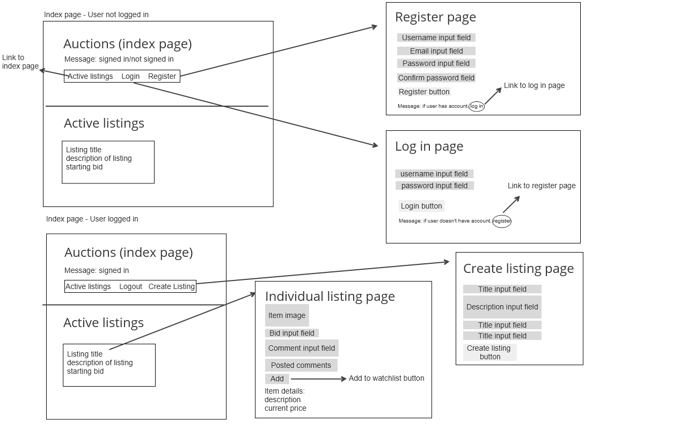
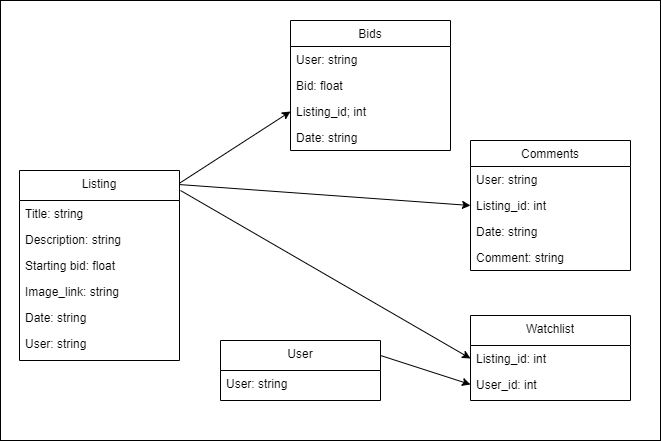

# Commerce

An eBay-like e-commerce auction site that will allow users to post auction listings, place bids on listings, comment on those listings, and add listings to a “watchlist.”


## Getting Started

To get started, you need to have Python3 and pip installed.
Once you've done that, run the following command in your terminal: 
```
pip3 install Django
```

Next, `cd` into the `commerce` directory. 

To make migrations, run `python3 manage.py makemigrations auctions` to make migrations for the `auctions` app.

Then run `python3 manage.py migrate` to apply migrations to the database. 

To run the application, run the command:
```
python manage.py runserver
```

## Web Application Sketch


## Models needed


## Database Info Used per Page
* index.html: This page will use info from the Listing model. It will display each active listing.

* listing.html: This page will use info from the models: Listing, Watchlist, Comment and Bid.

* create.html: This page will use the Listing model. The user will be creating a new Listing object.

* login.html: This page will use info from the User model. If the user's login info is correct, a User object will be returned and will enable the user to log in.

* register.html: This page will use the User model. The user will create a new User object.


